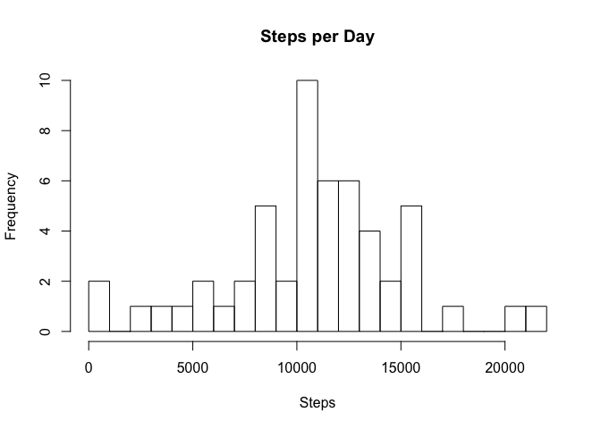
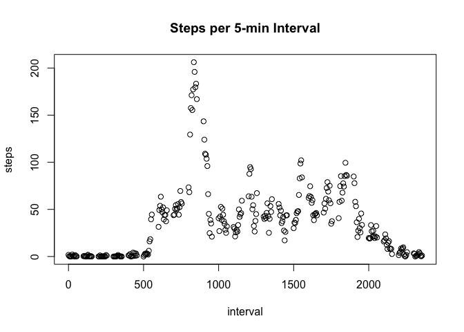
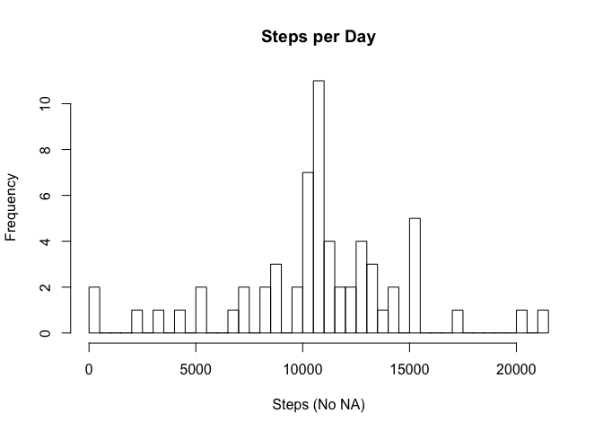
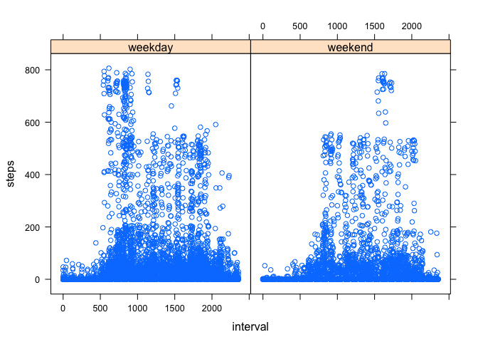

Reproducible Research Course Project 1
=========================================

## READ IN DATA


```r
Proj1Data <- read.csv("activity.csv")
head(Proj1Data)
```

```
##   steps       date interval
## 1    NA 2012-10-01        0
## 2    NA 2012-10-01        5
## 3    NA 2012-10-01       10
## 4    NA 2012-10-01       15
## 5    NA 2012-10-01       20
## 6    NA 2012-10-01       25
```
                        
## WHAT IS THE TOTAL NUMBER OF STEPS TAKEN PER DAY
reference:  http://stackoverflow.com/questions/26360076/mean-and-median-vs-summary 


```r
SumSteps <- aggregate(steps~date, data = Proj1Data, sum)
plothiststeps <- hist(SumSteps$steps, breaks = 27, # ca. 2 days/break,
                      xlab = "Steps",
                      main = "Steps per Day")
```

\

```r
MeanSteps <- mean(SumSteps$steps)
MedianSteps <- median(SumSteps$steps)
MeanSteps
```

```
## [1] 10766.19
```

```r
MedianSteps
```

```
## [1] 10765
```

## WHAT IS THE AVERAGE DAILY ACTIVITY PATTERN


```r
MeanStepsPerInterval <- aggregate(steps~interval, data = Proj1Data, mean)
PlotStepsInterval <- with(MeanStepsPerInterval, plot(interval, steps, main = "Steps per 5-min Interval"))
```

\

```r
PlotStepsInterval
```

```
## NULL
```

# Most steps occur at interval 835
                                             


## IMPUTING MISSING VALUES
refernced http://stackoverflow.com/questions/30849280/sum-na-values-in-r, 
http://stackoverflow.com/questions/22916525/replace-na-with-previous-and-next-rows-mean-in-r, 
http://stackoverflow.com/questions/34340801/replacing-na-values-with-the-mean-value-aggregated-over-an-interval, and
http://publish.illinois.edu/spencer-guerrero/2014/12/11/2-dealing-with-missing-data-in-r-omit-approx-or-spline-part-1/

###  What is the total number of NAs

```r
NumberNAs <- sum(is.na(Proj1Data$steps))
NumberNAs
```

```
## [1] 2304
```
# Number of NAs = 2304

###  Replace NAs with another acceptable value.  

```r
library(zoo)
```

```
## 
## Attaching package: 'zoo'
```

```
## The following objects are masked from 'package:base':
## 
##     as.Date, as.Date.numeric
```

```r
Proj1DataNoNA <- Proj1Data
Proj1DataNoNA$steps <- ave(Proj1Data$steps, Proj1Data$interval, FUN=na.aggregate)
SumNoNASteps <- aggregate(steps~date, data = Proj1DataNoNA, sum)
plothistNoNAsteps <- hist(SumNoNASteps$steps, breaks = 31, # ca. 2 days/break,
                      xlab = "Steps (No NA)",
                      main = "Steps per Day")
```

\

```r
MeanNoNASteps <- mean(SumNoNASteps$steps)
MedianNoNASteps <- median(SumNoNASteps$steps)
MeanNoNASteps
```

```
## [1] 10766.19
```

```r
MedianNoNASteps
```

```
## [1] 10766.19
```

##  ARE THERE DIFFERENCES IN ACTIVITY PATTERNS BETWEEN WEEKDAYS AND WEEKENDS
Referenced http://stackoverflow.com/questions/16570302/
how-to-add-a-factor-column-to-dataframe-based-on-a-conditional-statement-from-an, http://stackoverflow.com/questions/17496358/r-help-converting-factor-to-date, and
http://stackoverflow.com/questions/9354284/having-trouble-with-lattice-and-plotting-events-as-time-series-line-graphs


```r
Proj1DataNoNA$date <- as.Date(Proj1Data$date, format='%Y-%m-%d')
Proj1DataNoNA$DayType <- ifelse((weekdays(Proj1DataNoNA$date) == "Sunday"|weekdays(Proj1DataNoNA$date) 
                                 == "Saturday"),"weekend", "weekday")
head(Proj1DataNoNA$DayType)
```

```
## [1] "weekday" "weekday" "weekday" "weekday" "weekday" "weekday"
```

```r
library(lattice)
MeanNoNAStepsPerInterval <- aggregate(steps~interval, data = Proj1DataNoNA, mean)
TSplotDayType <- xyplot(steps~interval|DayType, Proj1DataNoNA)
TSplotDayType
```

\


